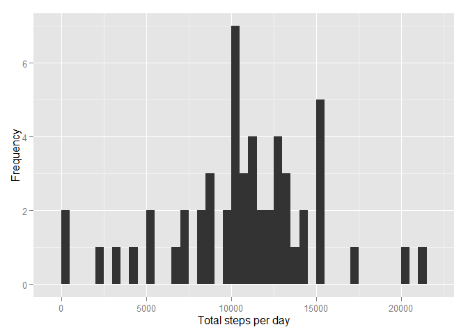
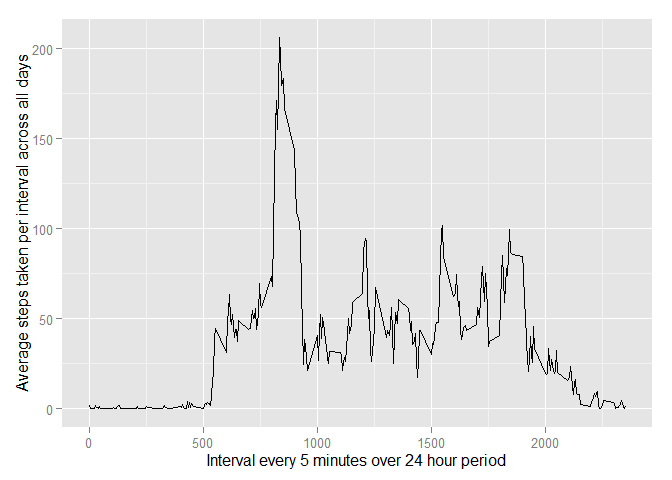
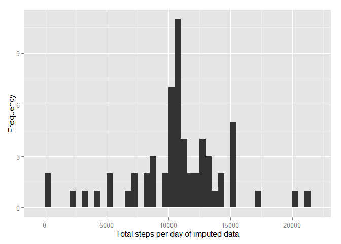
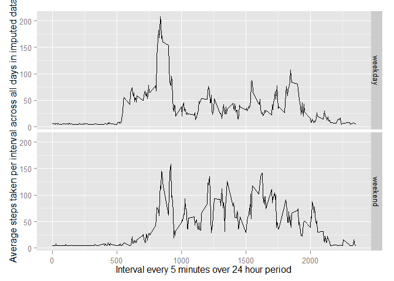

# Reproducible Research: Peer Assessment 1


##Init
Libraries used

```r
library(ggplot2)
```


## Loading and preprocessing the data

1. Load the data (i.e. read.csv())


```r
Activity <- read.csv('activity.csv')
```

2. Process/transform the data (if necessary) into a format suitable for your analysis
None used here


## What is mean total number of steps taken per day?

1. Calculate the total number of steps taken per day

```r
StepsPerDay <- aggregate(steps~date,Activity, sum)
```
2. Make a histogram of the total number of steps taken each day

```r
qplot(StepsPerDay$steps, xlab='Total steps per day', ylab='Frequency', binwidth=500)
```

 

3. Calculate and report the mean and median of the total number of steps taken per day


```r
StepsMean <- mean(StepsPerDay$steps)
StepsMedian <- median(StepsPerDay$steps)
```

For the total steps per day in the activity data:

Mean = 1.0766189\times 10^{4}

Median = 10765


## What is the average daily activity pattern?
1. Make a time series plot (i.e. type = "l") of the 5-minute interval (x-axis) and the average number of steps taken, averaged across all days (y-axis)


```r
StepsAvgPerTime <- aggregate(steps~interval,Activity, mean)
qplot(interval, steps, data=StepsAvgPerTime, geom = "line", xlab = "Interval every 5 minutes over 24 hour period", ylab="Average steps taken per interval across all days")
```

 


2. Which 5-minute interval, on average across all the days in the dataset, contains the maximum number of steps?

```r
MaxStepsInterval <- StepsAvgPerTime[which.max(StepsAvgPerTime$steps),'interval']
```

835 is the time interval with the highest daily average of steps.


## Imputing missing values
1. Calculate and report the total number of missing values in the dataset (i.e. the total number of rows with NAs)

```r
Missing <- length(which(is.na(Activity$steps)))
```
There are 2304 rows where the steps is missing.


2. Devise a strategy for filling in all of the missing values in the dataset. 

THe Imputed data will have the Null values replaced with the mean of all steps (37.3825996)


3. Create a new dataset that is equal to the original dataset but with the missing data filled in.


```r
Imputed <- Activity
for (i in which(sapply(Imputed, is.numeric))) {
     Imputed[is.na(Imputed[, i]), i] <- mean(Imputed[, i],  na.rm = TRUE)
}
```


4. Make a histogram of the total number of steps taken each day ...


```r
ImputedStepsPerDay <- aggregate(steps~date,Imputed, sum)
qplot(ImputedStepsPerDay$steps, xlab='Total steps per day of imputed data', ylab='Frequency', binwidth=500)
```

 


...and Calculate and report the mean and median total number of steps taken per day. 


```r
StepsMeanImputed <- mean(ImputedStepsPerDay$steps)
StepsMedianImputed <- median(ImputedStepsPerDay$steps)
```


For the steps in the imputed activity data:

Mean = 1.0766189\times 10^{4}

Median = 10765


Do these values differ from the estimates from the first part of the assignment? What is the impact of imputing missing data on the estimates of the total daily number of steps?


```r
MeanVariance <- StepsMean - StepsMeanImputed
MedianVariance <- StepsMedian - StepsMedianImputed
```

The variance of of all steps between raw and imputed is:

Variance of Mean: 0

Varianace of Median: -1.1886792


## Are there differences in activity patterns between weekdays and weekends?
1. Create a new factor variable in the dataset with two levels - "weekday" and "weekend" indicating whether a given date is a weekday or weekend day.


```r
Imputed$WeekPart <-  ifelse(as.POSIXlt(Imputed$date)$wday %in% c(0,6), 'weekend', 'weekday')
```

2. Make a panel plot containing a time series plot (i.e. type = "l") of the 5-minute interval (x-axis) and the average number of steps taken, averaged across all weekday days or weekend days (y-axis).


```r
ImputedStepsPerDayByWeekPart <- aggregate(steps ~ interval + WeekPart, data=Imputed, mean)

qplot(interval, steps, data=ImputedStepsPerDayByWeekPart, geom = "line", xlab = "Interval every 5 minutes over 24 hour period", ylab="Average steps taken per interval across all days in imputed data", facets="WeekPart ~ .")
```

 
